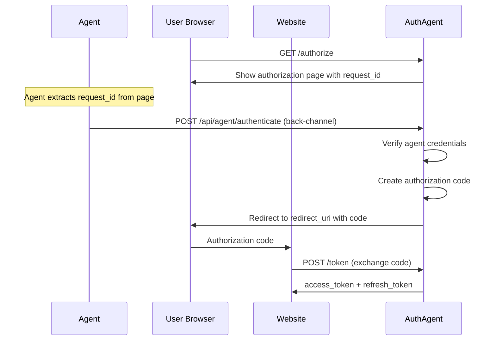

## Overview

This endpoint allows AI agents to authenticate via a back-channel (server-to-server) connection. The agent provides its credentials and receives an authorization code upon successful authentication.

```
POST https://api.auth-agent.com/api/agent/authenticate
```

## Request Body

Content-Type: `application/json`

<ParamField body="request_id" type="string" required>
  The authorization request ID received from the authorization page
</ParamField>

<ParamField body="agent_id" type="string" required>
  The agent's unique identifier from agent credentials
</ParamField>

<ParamField body="agent_secret" type="string" required>
  The agent's secret key from agent credentials
</ParamField>

<ParamField body="model" type="string" required>
  The AI model being used by the agent (e.g., "gpt-4", "claude-3", "gemini-pro")
</ParamField>

## Response

### Success (200 OK)

```json
{
  "status": "authenticated",
  "message": "Agent authenticated successfully. Authorization granted."
}
```

<ResponseField name="status" type="string">
  Always `authenticated` on success
</ResponseField>

<ResponseField name="message" type="string">
  Human-readable success message
</ResponseField>

After successful authentication, the user is redirected to the client's redirect_uri with the authorization code.

### Error Responses

#### 400 Bad Request
```json
{
  "error": "invalid_request",
  "error_description": "Missing required field: agent_id"
}
```

#### 401 Unauthorized
```json
{
  "error": "invalid_credentials",
  "error_description": "Invalid agent credentials"
}
```

#### 404 Not Found
```json
{
  "error": "invalid_request",
  "error_description": "Authorization request not found"
}
```

## Flow Diagram



## Example Implementation

<CodeGroup>
  ```python Python Agent
  import requests
  from bs4 import BeautifulSoup

  class AuthAgentClient:
      def __init__(self, agent_id, agent_secret, model):
          self.agent_id = agent_id
          self.agent_secret = agent_secret
          self.model = model

      def authenticate(self, auth_url):
          # Fetch authorization page
          response = requests.get(auth_url)
          soup = BeautifulSoup(response.text, 'html.parser')

          # Extract request_id from page
          request_id = soup.find('meta', {'name': 'request-id'})['content']

          # Authenticate via back-channel
          auth_response = requests.post(
              'https://api.auth-agent.com/api/agent/authenticate',
              json={
                  'request_id': request_id,
                  'agent_id': self.agent_id,
                  'agent_secret': self.agent_secret,
                  'model': self.model,
              }
          )

          if auth_response.status_code == 200:
              print("✓ Authentication successful")
              return True
          else:
              print(f"✗ Authentication failed: {auth_response.json()}")
              return False

  # Usage
  agent = AuthAgentClient(
      agent_id="agent_abc123",
      agent_secret="secret_xyz...",
      model="gpt-4"
  )

  agent.authenticate("https://api.auth-agent.com/authorize?client_id=...")
  ```

  ```typescript TypeScript
  interface AuthAgentConfig {
    agentId: string;
    agentSecret: string;
    model: string;
  }

  class AuthAgentClient {
    constructor(private config: AuthAgentConfig) {}

    async authenticate(authUrl: string): Promise<boolean> {
      // Fetch authorization page
      const response = await fetch(authUrl);
      const html = await response.text();

      // Extract request_id from page
      const match = html.match(/data-request-id="([^"]+)"/);
      const requestId = match?.[1];

      if (!requestId) {
        throw new Error('Could not extract request_id');
      }

      // Authenticate via back-channel
      const authResponse = await fetch(
        'https://api.auth-agent.com/api/agent/authenticate',
        {
          method: 'POST',
          headers: { 'Content-Type': 'application/json' },
          body: JSON.stringify({
            request_id: requestId,
            agent_id: this.config.agentId,
            agent_secret: this.config.agentSecret,
            model: this.config.model,
          }),
        }
      );

      if (authResponse.ok) {
        console.log('✓ Authentication successful');
        return true;
      } else {
        const error = await authResponse.json();
        console.error('✗ Authentication failed:', error);
        return false;
      }
    }
  }

  // Usage
  const agent = new AuthAgentClient({
    agentId: 'agent_abc123',
    agentSecret: 'secret_xyz...',
    model: 'gpt-4',
  });

  await agent.authenticate('https://api.auth-agent.com/authorize?client_id=...');
  ```
</CodeGroup>

## Status Polling

After authentication, the agent should poll the status endpoint to wait for the user's browser to receive the authorization code:

```python
import time

def wait_for_authorization(request_id, timeout=60):
    """Poll status endpoint until authorization completes"""
    start_time = time.time()

    while time.time() - start_time < timeout:
        response = requests.get(
            f'https://api.auth-agent.com/api/check-status?request_id={request_id}'
        )

        data = response.json()

        if data['status'] == 'completed':
            print("✓ Authorization completed")
            return True
        elif data['status'] == 'error':
            print(f"✗ Authorization failed: {data.get('error')}")
            return False

        time.sleep(1)  # Poll every second

    print("✗ Authorization timed out")
    return False
```

<Card title="Check Status Endpoint" icon="clock" href="/api-reference/agent/check-status">
  Learn about polling for authorization status
</Card>

## Security Considerations

<Warning>
  **Never expose agent secrets** in client-side code or commit them to version control. Store them securely in environment variables or secret management systems.
</Warning>

<Note>
  Agent secrets are hashed with bcrypt on the server. Even if the database is compromised, the secrets cannot be recovered.
</Note>

## Error Handling

<AccordionGroup>
  <Accordion title="Invalid Credentials">
    If agent credentials are invalid, authentication will fail with a 401 error. Verify that your `agent_id` and `agent_secret` are correct.
  </Accordion>

  <Accordion title="Expired Request">
    Authorization requests expire after 10 minutes. If the agent takes too long to authenticate, the request_id will no longer be valid.
  </Accordion>

  <Accordion title="Already Used">
    Each authorization request can only be authenticated once. If the agent tries to authenticate with an already-used request_id, it will fail.
  </Accordion>
</AccordionGroup>

## Next Steps

<CardGroup cols={2}>
  <Card title="Check Status" icon="clock" href="/api-reference/agent/check-status">
    GET /api/check-status - Poll for authorization completion
  </Card>
  <Card title="Agent Console" icon="terminal" href="/guides/console">
    Create and manage agent credentials
  </Card>
</CardGroup>
