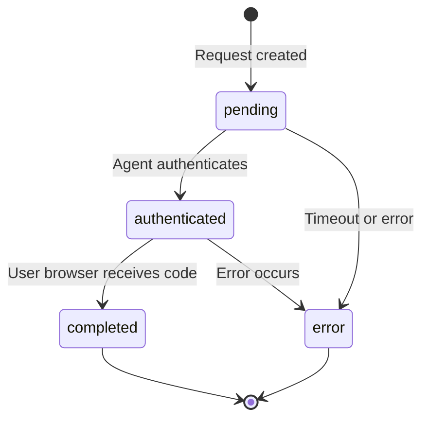

## Overview

This endpoint allows agents to poll for the status of an authorization request. The agent should poll this endpoint after authenticating to know when the authorization flow is complete.

```
GET https://api.auth-agent.com/api/check-status?request_id={request_id}
```

## Query Parameters

<ParamField query="request_id" type="string" required>
  The authorization request ID
</ParamField>

## Response

### Pending (200 OK)

Authorization is still in progress:

```json
{
  "status": "pending"
}
```

### Authenticated (200 OK)

Agent has authenticated, waiting for user's browser to receive the code:

```json
{
  "status": "authenticated"
}
```

### Completed (200 OK)

Authorization is complete, user's browser has received the code:

```json
{
  "status": "completed"
}
```

### Error (200 OK)

An error occurred during authorization:

```json
{
  "status": "error",
  "error": "request_expired",
  "error_description": "Authorization request has expired"
}
```

### Not Found (404)

Authorization request doesn't exist:

```json
{
  "error": "not_found",
  "error_description": "Authorization request not found"
}
```

## Status Flow



## Polling Strategy

<AccordionGroup>
  <Accordion title="Polling Interval">
    Poll every 1-2 seconds to balance responsiveness with server load.

    ```python
    import time

    def poll_status(request_id, timeout=60):
        start_time = time.time()

        while time.time() - start_time < timeout:
            status = check_status(request_id)

            if status in ['completed', 'error']:
                return status

            time.sleep(1)  # Poll every second

        return 'timeout'
    ```
  </Accordion>

  <Accordion title="Timeout Handling">
    Set a reasonable timeout (30-60 seconds) for polling. Authorization requests expire after 10 minutes.

    ```typescript
    async function waitForCompletion(requestId: string, timeout = 60000) {
      const startTime = Date.now();

      while (Date.now() - startTime < timeout) {
        const response = await fetch(
          `https://api.auth-agent.com/api/check-status?request_id=${requestId}`
        );

        const data = await response.json();

        if (data.status === 'completed') {
          return { success: true };
        }

        if (data.status === 'error') {
          return { success: false, error: data.error };
        }

        await new Promise(resolve => setTimeout(resolve, 1000));
      }

      return { success: false, error: 'timeout' };
    }
    ```
  </Accordion>

  <Accordion title="Exponential Backoff">
    For long-running processes, implement exponential backoff to reduce server load:

    ```python
    import time

    def poll_with_backoff(request_id, max_timeout=300):
        interval = 1
        elapsed = 0

        while elapsed < max_timeout:
            status = check_status(request_id)

            if status in ['completed', 'error']:
                return status

            time.sleep(interval)
            elapsed += interval

            # Exponential backoff: 1s, 2s, 4s, 8s, max 30s
            interval = min(interval * 2, 30)

        return 'timeout'
    ```
  </Accordion>
</AccordionGroup>

## Complete Example

<CodeGroup>
  ```python Python
  import requests
  import time
  from typing import Dict, Optional

  class AuthAgentFlow:
      def __init__(self, agent_id: str, agent_secret: str, model: str):
          self.agent_id = agent_id
          self.agent_secret = agent_secret
          self.model = model
          self.base_url = "https://api.auth-agent.com"

      def authenticate(self, auth_url: str) -> Optional[str]:
          """Complete authentication flow and return authorization code"""

          # Extract request_id from auth page
          response = requests.get(auth_url)
          # ... parse request_id from HTML ...

          request_id = "req_abc123"  # Extracted from page

          # Authenticate via back-channel
          auth_response = requests.post(
              f"{self.base_url}/api/agent/authenticate",
              json={
                  "request_id": request_id,
                  "agent_id": self.agent_id,
                  "agent_secret": self.agent_secret,
                  "model": self.model,
              }
          )

          if auth_response.status_code != 200:
              print(f"Authentication failed: {auth_response.json()}")
              return None

          # Poll for completion
          return self.poll_status(request_id)

      def poll_status(self, request_id: str, timeout: int = 60) -> Optional[str]:
          """Poll status endpoint until completion"""
          start_time = time.time()

          while time.time() - start_time < timeout:
              response = requests.get(
                  f"{self.base_url}/api/check-status",
                  params={"request_id": request_id}
              )

              data = response.json()

              if data["status"] == "completed":
                  print("✓ Authorization completed")
                  # Note: The authorization code is sent to the user's browser,
                  # not returned here. This endpoint just confirms completion.
                  return "completed"

              elif data["status"] == "error":
                  print(f"✗ Error: {data.get('error_description')}")
                  return None

              print(f"Status: {data['status']}...")
              time.sleep(1)

          print("✗ Timeout waiting for authorization")
          return None

  # Usage
  agent = AuthAgentFlow(
      agent_id="agent_abc123",
      agent_secret="secret_xyz...",
      model="gpt-4"
  )

  result = agent.authenticate("https://api.auth-agent.com/authorize?...")
  ```

  ```typescript TypeScript
  class AuthAgentFlow {
    constructor(
      private config: {
        agentId: string;
        agentSecret: string;
        model: string;
      }
    ) {}

    async authenticate(authUrl: string): Promise<boolean> {
      // Extract request_id from auth page
      const requestId = await this.extractRequestId(authUrl);

      // Authenticate via back-channel
      const authResponse = await fetch(
        'https://api.auth-agent.com/api/agent/authenticate',
        {
          method: 'POST',
          headers: { 'Content-Type': 'application/json' },
          body: JSON.stringify({
            request_id: requestId,
            agent_id: this.config.agentId,
            agent_secret: this.config.agentSecret,
            model: this.config.model,
          }),
        }
      );

      if (!authResponse.ok) {
        console.error('Authentication failed');
        return false;
      }

      // Poll for completion
      return await this.pollStatus(requestId);
    }

    async pollStatus(requestId: string, timeout = 60000): Promise<boolean> {
      const startTime = Date.now();

      while (Date.now() - startTime < timeout) {
        const response = await fetch(
          `https://api.auth-agent.com/api/check-status?request_id=${requestId}`
        );

        const data = await response.json();

        if (data.status === 'completed') {
          console.log('✓ Authorization completed');
          return true;
        }

        if (data.status === 'error') {
          console.error('✗ Error:', data.error_description);
          return false;
        }

        console.log(`Status: ${data.status}...`);
        await new Promise(resolve => setTimeout(resolve, 1000));
      }

      console.error('✗ Timeout');
      return false;
    }

    private async extractRequestId(authUrl: string): Promise<string> {
      const response = await fetch(authUrl);
      const html = await response.text();
      const match = html.match(/data-request-id="([^"]+)"/);
      return match?.[1] || '';
    }
  }
  ```
</CodeGroup>

## Important Notes

<Warning>
  The authorization code is sent to the user's browser (redirect_uri), not returned by this endpoint. Use this endpoint only to know when the flow is complete.
</Warning>

<Note>
  Status polling is optional. Most agents can authenticate and then let the user's browser complete the flow naturally. Polling is useful if you need to know precisely when authorization completes.
</Note>

## Next Steps

<CardGroup cols={2}>
  <Card title="Authenticate" icon="shield-check" href="/api-reference/agent/authenticate">
    POST /api/agent/authenticate - Back-channel authentication
  </Card>
  <Card title="Complete Flow Example" icon="book-code" href="/guides/examples">
    See full agent integration examples
  </Card>
</CardGroup>
