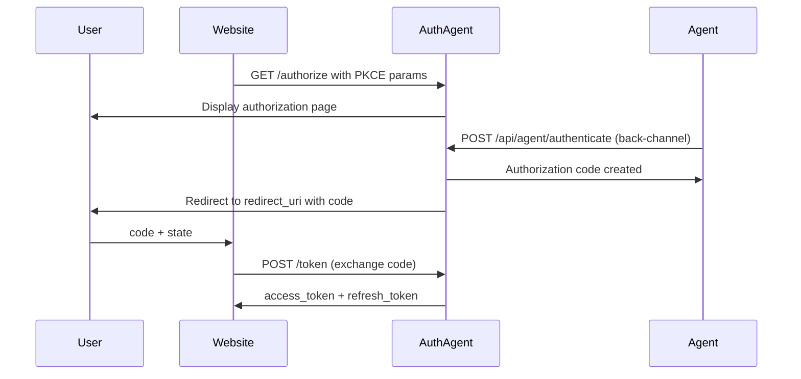

## Overview

The authorization endpoint is used to initiate the OAuth 2.1 authorization flow. This endpoint presents the user with an authorization page where they can approve the agent's access request.

```
GET https://api.auth-agent.com/authorize
```

## Query Parameters

<ParamField query="client_id" type="string" required>
  The OAuth client identifier provided during client registration
</ParamField>

<ParamField query="redirect_uri" type="string" required>
  The URI where the user will be redirected after authorization. Must exactly match one of the registered redirect URIs for the client. Must use HTTPS except for localhost.
</ParamField>

<ParamField query="response_type" type="string" required>
  Must be `code` for authorization code flow
</ParamField>

<ParamField query="state" type="string" required>
  An opaque value used to maintain state between the request and callback. This prevents CSRF attacks. Should be a random, unguessable string.
</ParamField>

<ParamField query="code_challenge" type="string" required>
  PKCE code challenge derived from the code verifier using SHA-256
</ParamField>

<ParamField query="code_challenge_method" type="string" required>
  Must be `S256` (SHA-256 hashing). Plain code challenges are not supported.
</ParamField>

<ParamField query="scope" type="string" optional>
  Space-separated list of scopes requested. If not provided, defaults to `openid email profile`.

  Available scopes:
  - `openid` - OpenID Connect authentication
  - `email` - Access to user email address
  - `profile` - Access to user profile (name)
</ParamField>

## Response

### Success (302 Redirect)

If validation succeeds, the user is presented with an authorization page. After the agent authenticates via back-channel and the user approves, they are redirected to the `redirect_uri` with the authorization code:

```
{redirect_uri}?code={authorization_code}&state={state}
```

#### Redirect Parameters

| Parameter | Type | Description |
|-----------|------|-------------|
| `code` | string | Authorization code to exchange for tokens (expires in 10 minutes) |
| `state` | string | The same state value provided in the authorization request |

### Error (400 Bad Request)

If validation fails, an HTML error page is displayed with the error details:

```json
{
  "error": "invalid_request",
  "error_description": "Missing client_id parameter"
}
```

## Error Codes

| Error Code | Description |
|------------|-------------|
| `invalid_request` | Missing or invalid required parameter |
| `invalid_client` | Client not found or inactive |
| `unsupported_response_type` | Response type is not `code` |

## Flow Diagram



## Example Request

<CodeGroup>
  ```typescript Next.js
  // Generate PKCE parameters
  const codeVerifier = generateCodeVerifier();
  const codeChallenge = await generateCodeChallenge(codeVerifier);

  // Store code verifier for later use in token exchange
  sessionStorage.setItem('code_verifier', codeVerifier);

  // Build authorization URL
  const params = new URLSearchParams({
    client_id: 'client_abc123',
    redirect_uri: 'https://yourwebsite.com/api/auth/callback',
    response_type: 'code',
    code_challenge: codeChallenge,
    code_challenge_method: 'S256',
    scope: 'openid email profile',
    state: generateRandomState(),
  });

  // Redirect user to Auth Agent
  window.location.href = `https://api.auth-agent.com/authorize?${params}`;
  ```

  ```typescript Express
  app.get('/auth/login', async (req, res) => {
    const codeVerifier = generateCodeVerifier();
    const codeChallenge = await generateCodeChallenge(codeVerifier);

    // Store code verifier in session
    req.session.codeVerifier = codeVerifier;

    const params = new URLSearchParams({
      client_id: process.env.AUTH_AGENT_CLIENT_ID,
      redirect_uri: `${process.env.BASE_URL}/api/auth/callback`,
      response_type: 'code',
      code_challenge: codeChallenge,
      code_challenge_method: 'S256',
      scope: 'openid email profile',
      state: generateRandomState(),
    });

    res.redirect(`https://api.auth-agent.com/authorize?${params}`);
  });
  ```

  ```python Flask
  from urllib.parse import urlencode
  from flask import redirect, session
  from auth_agent import generate_pkce

  @app.route('/auth/login')
  def login():
      # Generate PKCE parameters
      code_verifier, code_challenge = generate_pkce()

      # Store code verifier in session
      session['code_verifier'] = code_verifier

      # Build authorization URL
      params = {
          'client_id': os.environ['AUTH_AGENT_CLIENT_ID'],
          'redirect_uri': f"{os.environ['BASE_URL']}/api/auth/callback",
          'response_type': 'code',
          'code_challenge': code_challenge,
          'code_challenge_method': 'S256',
          'scope': 'openid email profile',
          'state': generate_random_state(),
      }

      auth_url = f"https://api.auth-agent.com/authorize?{urlencode(params)}"
      return redirect(auth_url)
  ```
</CodeGroup>

## PKCE Implementation

<Accordion title="Generating Code Verifier and Challenge">
  ```typescript
  // Generate code verifier (random string)
  export function generateCodeVerifier(): string {
    const array = new Uint8Array(32);
    crypto.getRandomValues(array);
    return base64URLEncode(array);
  }

  // Generate code challenge (SHA-256 hash of verifier)
  export async function generateCodeChallenge(verifier: string): Promise<string> {
    const encoder = new TextEncoder();
    const data = encoder.encode(verifier);
    const hash = await crypto.subtle.digest('SHA-256', data);
    return base64URLEncode(new Uint8Array(hash));
  }

  function base64URLEncode(buffer: Uint8Array): string {
    const base64 = btoa(String.fromCharCode(...buffer));
    return base64
      .replace(/\+/g, '-')
      .replace(/\//g, '_')
      .replace(/=/g, '');
  }
  ```
</Accordion>

## Security Considerations

<Warning>
  **Always use HTTPS** for redirect URIs in production. HTTP is only allowed for localhost during development.
</Warning>

<Note>
  **State parameter** is required to prevent CSRF attacks. Generate a random, unguessable value and verify it in your callback handler.
</Note>

<Info>
  **Code verifier** must be stored securely (session, cookie, or memory) and used in the subsequent token exchange request.
</Info>

## Next Steps

After successfully receiving an authorization code:

<CardGroup cols={2}>
  <Card title="Exchange Code for Tokens" icon="key" href="/api-reference/oauth/token">
    POST /token - Exchange the authorization code for access tokens
  </Card>
  <Card title="Get User Info" icon="user" href="/api-reference/oauth/userinfo">
    GET /userinfo - Retrieve user information using the access token
  </Card>
</CardGroup>
