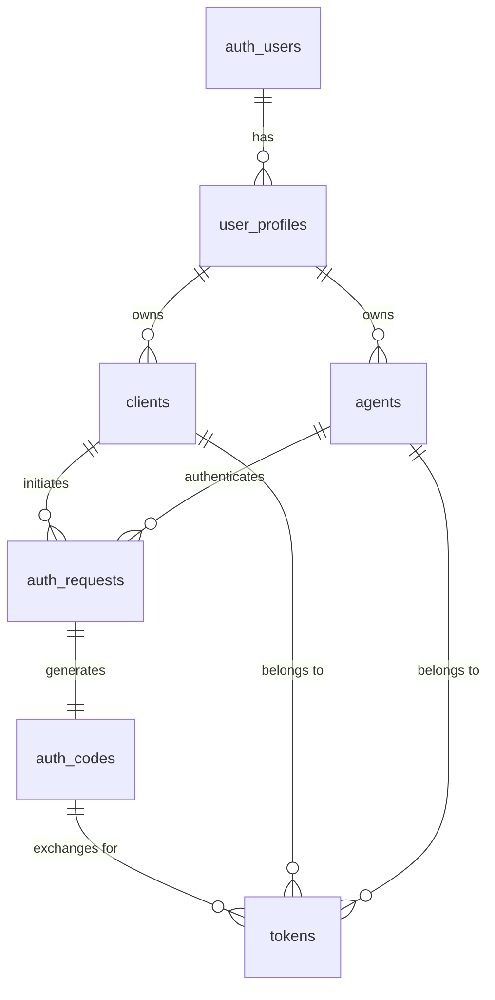

## Overview

Auth Agent uses **Supabase (PostgreSQL)** as its database. The schema consists of two main parts:

1. **Core OAuth Schema** (`schema.sql`) - OAuth clients, agents, authorization codes, and tokens
2. **Authentication Extension** (`schema-auth.sql`) - User authentication, profiles, and RLS policies

## Architecture



## Core Tables

### clients

OAuth client applications (websites) that integrate with Auth Agent.

```sql
CREATE TABLE clients (
    id UUID PRIMARY KEY DEFAULT uuid_generate_v4(),
    client_id TEXT UNIQUE NOT NULL,
    client_secret_hash TEXT NOT NULL,
    client_name TEXT NOT NULL,
    allowed_redirect_uris TEXT[] NOT NULL,
    user_id UUID REFERENCES auth.users(id) ON DELETE CASCADE,
    created_at TIMESTAMPTZ NOT NULL DEFAULT NOW(),
    updated_at TIMESTAMPTZ NOT NULL DEFAULT NOW()
);
```

**Fields:**
- `id` - Internal UUID
- `client_id` - Public client identifier (e.g., `client_my_website`)
- `client_secret_hash` - PBKDF2 hashed secret (100,000 iterations)
- `client_name` - Human-readable name
- `allowed_redirect_uris` - Array of valid callback URLs
- `user_id` - Owner's user ID (from Supabase Auth)
- `created_at` - Creation timestamp
- `updated_at` - Last update timestamp

**Indexes:**
```sql
CREATE INDEX idx_clients_client_id ON clients(client_id);
CREATE INDEX idx_clients_user_id ON clients(user_id);
```

**RLS Policies:**
- Users can only view/modify their own clients
- Admins can view all clients

### agents

AI agents that authenticate on behalf of users.

```sql
CREATE TABLE agents (
    id UUID PRIMARY KEY DEFAULT uuid_generate_v4(),
    agent_id TEXT UNIQUE NOT NULL,
    agent_secret_hash TEXT NOT NULL,
    user_email TEXT NOT NULL,
    user_name TEXT NOT NULL,
    user_id UUID REFERENCES auth.users(id) ON DELETE CASCADE,
    created_at TIMESTAMPTZ NOT NULL DEFAULT NOW(),
    updated_at TIMESTAMPTZ NOT NULL DEFAULT NOW()
);
```

**Fields:**
- `id` - Internal UUID
- `agent_id` - Public agent identifier (e.g., `agent_my_bot`)
- `agent_secret_hash` - PBKDF2 hashed secret (100,000 iterations)
- `user_email` - Owner's email for audit trail
- `user_name` - Human owner's name
- `user_id` - Owner's user ID (from Supabase Auth)
- `created_at` - Creation timestamp
- `updated_at` - Last update timestamp

**Indexes:**
```sql
CREATE INDEX idx_agents_agent_id ON agents(agent_id);
CREATE INDEX idx_agents_user_id ON agents(user_id);
```

**RLS Policies:**
- Users can only view/modify their own agents
- Admins can view all agents

### auth_requests

Pending authorization requests during OAuth flow.

```sql
CREATE TABLE auth_requests (
    id UUID PRIMARY KEY DEFAULT uuid_generate_v4(),
    request_id TEXT UNIQUE NOT NULL,
    client_id TEXT NOT NULL REFERENCES clients(client_id) ON DELETE CASCADE,
    redirect_uri TEXT NOT NULL,
    state TEXT NOT NULL,
    code_challenge TEXT NOT NULL,
    code_challenge_method TEXT NOT NULL DEFAULT 'S256',
    scope TEXT NOT NULL DEFAULT 'openid profile email',
    agent_id TEXT REFERENCES agents(agent_id) ON DELETE SET NULL,
    authenticated BOOLEAN NOT NULL DEFAULT FALSE,
    authorization_code TEXT,
    created_at TIMESTAMPTZ NOT NULL DEFAULT NOW(),
    expires_at TIMESTAMPTZ NOT NULL DEFAULT (NOW() + INTERVAL '10 minutes')
);
```

**Fields:**
- `id` - Internal UUID
- `request_id` - Public request identifier (exposed to agents via `window.authRequest`)
- `client_id` - Which client initiated the request
- `redirect_uri` - Where to redirect after authentication
- `state` - CSRF protection token
- `code_challenge` - PKCE challenge (SHA-256 hash of code_verifier)
- `code_challenge_method` - Always "S256" (SHA-256)
- `scope` - Requested scopes (default: "openid profile email")
- `agent_id` - Which agent authenticated (null until authentication)
- `authenticated` - Whether agent has authenticated
- `authorization_code` - Generated code after authentication
- `created_at` - Creation timestamp
- `expires_at` - Expiration time (10 minutes)

**Indexes:**
```sql
CREATE INDEX idx_auth_requests_request_id ON auth_requests(request_id);
CREATE INDEX idx_auth_requests_expires_at ON auth_requests(expires_at);
```

**TTL:** 10 minutes (auto-cleanup via scheduled job)

### auth_codes

Authorization codes for OAuth code exchange.

```sql
CREATE TABLE auth_codes (
    id UUID PRIMARY KEY DEFAULT uuid_generate_v4(),
    code TEXT UNIQUE NOT NULL,
    client_id TEXT NOT NULL REFERENCES clients(client_id) ON DELETE CASCADE,
    agent_id TEXT NOT NULL REFERENCES agents(agent_id) ON DELETE CASCADE,
    redirect_uri TEXT NOT NULL,
    code_challenge TEXT NOT NULL,
    model TEXT NOT NULL,
    scope TEXT NOT NULL,
    used BOOLEAN NOT NULL DEFAULT FALSE,
    created_at TIMESTAMPTZ NOT NULL DEFAULT NOW(),
    expires_at TIMESTAMPTZ NOT NULL DEFAULT (NOW() + INTERVAL '10 minutes')
);
```

**Fields:**
- `id` - Internal UUID
- `code` - Authorization code (opaque token)
- `client_id` - Which client will exchange this code
- `agent_id` - Which agent authenticated
- `redirect_uri` - Must match when exchanging code
- `code_challenge` - PKCE challenge for verification
- `model` - AI model identifier (e.g., "gpt-4")
- `scope` - Granted scopes
- `used` - Whether code has been exchanged (prevents replay)
- `created_at` - Creation timestamp
- `expires_at` - Expiration time (10 minutes)

**Indexes:**
```sql
CREATE INDEX idx_auth_codes_code ON auth_codes(code);
CREATE INDEX idx_auth_codes_expires_at ON auth_codes(expires_at);
```

**TTL:** 10 minutes (auto-cleanup via scheduled job)
**Single Use:** `used` flag prevents code replay attacks

### tokens

Access and refresh tokens.

```sql
CREATE TABLE tokens (
    id UUID PRIMARY KEY DEFAULT uuid_generate_v4(),
    token_id TEXT UNIQUE NOT NULL,
    access_token TEXT NOT NULL,
    refresh_token TEXT NOT NULL,
    agent_id TEXT NOT NULL REFERENCES agents(agent_id) ON DELETE CASCADE,
    client_id TEXT NOT NULL REFERENCES clients(client_id) ON DELETE CASCADE,
    model TEXT NOT NULL,
    scope TEXT NOT NULL,
    revoked BOOLEAN NOT NULL DEFAULT FALSE,
    access_token_expires_at TIMESTAMPTZ NOT NULL,
    refresh_token_expires_at TIMESTAMPTZ NOT NULL,
    created_at TIMESTAMPTZ NOT NULL DEFAULT NOW()
);
```

**Fields:**
- `id` - Internal UUID
- `token_id` - Unique token identifier (for introspection)
- `access_token` - JWT access token
- `refresh_token` - Opaque refresh token
- `agent_id` - Which agent this token belongs to
- `client_id` - Which client this token belongs to
- `model` - AI model identifier
- `scope` - Granted scopes
- `revoked` - Whether token has been revoked
- `access_token_expires_at` - Access token expiration (1 hour)
- `refresh_token_expires_at` - Refresh token expiration (30 days)
- `created_at` - Creation timestamp

**Indexes:**
```sql
CREATE INDEX idx_tokens_token_id ON tokens(token_id);
CREATE INDEX idx_tokens_access_token ON tokens(access_token);
CREATE INDEX idx_tokens_refresh_token ON tokens(refresh_token);
CREATE INDEX idx_tokens_agent_id ON tokens(agent_id);
```

**TTL:**
- Access tokens: 1 hour
- Refresh tokens: 30 days

## Authentication Extension Tables

### user_profiles

User profiles for console authentication.

```sql
CREATE TYPE user_role AS ENUM ('admin', 'agent_owner', 'website_developer');

CREATE TABLE user_profiles (
    id UUID PRIMARY KEY REFERENCES auth.users(id) ON DELETE CASCADE,
    email TEXT NOT NULL,
    full_name TEXT,
    role user_role NOT NULL DEFAULT 'agent_owner',
    created_at TIMESTAMPTZ NOT NULL DEFAULT NOW(),
    updated_at TIMESTAMPTZ NOT NULL DEFAULT NOW()
);
```

**Fields:**
- `id` - User ID (references `auth.users` from Supabase Auth)
- `email` - User's email address
- `full_name` - User's full name
- `role` - User role (admin, agent_owner, website_developer)
- `created_at` - Creation timestamp
- `updated_at` - Last update timestamp

**Indexes:**
```sql
CREATE INDEX idx_user_profiles_role ON user_profiles(role);
```

**Roles:**
- `admin` - Full access to all resources
- `agent_owner` - Can manage own agents
- `website_developer` - Can manage own OAuth clients

### Auto-Creation Trigger

User profiles are automatically created when users sign up:

```sql
CREATE OR REPLACE FUNCTION public.handle_new_user()
RETURNS TRIGGER AS $$
BEGIN
    INSERT INTO public.user_profiles (id, email, full_name, role)
    VALUES (
        NEW.id,
        NEW.email,
        NEW.raw_user_meta_data->>'full_name',
        'agent_owner'
    );
    RETURN NEW;
END;
$$ LANGUAGE plpgsql SECURITY DEFINER;

CREATE TRIGGER on_auth_user_created
AFTER INSERT ON auth.users
FOR EACH ROW EXECUTE FUNCTION public.handle_new_user();
```

## Row Level Security (RLS)

### Agents RLS Policies

**Users can view their own agents:**
```sql
CREATE POLICY "Users can view own agents"
ON agents FOR SELECT
USING (auth.uid() = user_id);
```

**Users can create their own agents:**
```sql
CREATE POLICY "Users can create own agents"
ON agents FOR INSERT
WITH CHECK (auth.uid() = user_id);
```

**Users can update their own agents:**
```sql
CREATE POLICY "Users can update own agents"
ON agents FOR UPDATE
USING (auth.uid() = user_id);
```

**Users can delete their own agents:**
```sql
CREATE POLICY "Users can delete own agents"
ON agents FOR DELETE
USING (auth.uid() = user_id);
```

**Admins can view all agents:**
```sql
CREATE POLICY "Admins can view all agents"
ON agents FOR SELECT
USING (
    EXISTS (
        SELECT 1 FROM user_profiles
        WHERE user_profiles.id = auth.uid()
        AND user_profiles.role = 'admin'
    )
);
```

### Clients RLS Policies

Same pattern as agents - users can only access their own, admins can access all.

### User Profiles RLS Policies

**Users can view their own profile:**
```sql
CREATE POLICY "Users can view own profile"
ON user_profiles FOR SELECT
USING (auth.uid() = id);
```

**Users can update their own profile:**
```sql
CREATE POLICY "Users can update own profile"
ON user_profiles FOR UPDATE
USING (auth.uid() = id);
```

## Views

### active_tokens

View of non-revoked, non-expired tokens with join to agents and clients:

```sql
CREATE VIEW active_tokens AS
SELECT
    t.*,
    a.agent_id,
    a.user_email as agent_email,
    c.client_name
FROM tokens t
JOIN agents a ON t.agent_id = a.agent_id
JOIN clients c ON t.client_id = c.client_id
WHERE
    t.revoked = FALSE
    AND t.access_token_expires_at > NOW();
```

### pending_auth_requests

View of unauthenticated, non-expired authorization requests:

```sql
CREATE VIEW pending_auth_requests AS
SELECT
    ar.*,
    c.client_name
FROM auth_requests ar
JOIN clients c ON ar.client_id = c.client_id
WHERE
    ar.authenticated = FALSE
    AND ar.expires_at > NOW();
```

## Data Lifecycle

### Authorization Flow Lifecycle

1. **Request Created** → `auth_requests` (TTL: 10 minutes)
2. **Agent Authenticates** → `authenticated = TRUE`, generates `authorization_code`
3. **Code Generated** → `auth_codes` (TTL: 10 minutes, single use)
4. **Code Exchanged** → `tokens` (access: 1 hour, refresh: 30 days)
5. **Token Used** → Validate via introspection
6. **Token Expired** → Refresh with refresh token
7. **Token Revoked** → `revoked = TRUE`

### Cleanup

Expired records are cleaned up via scheduled jobs:

- `auth_requests`: DELETE WHERE `expires_at` < NOW()
- `auth_codes`: DELETE WHERE `expires_at` < NOW()
- `tokens`: Can be soft-deleted (set `revoked = TRUE`) or hard-deleted after `refresh_token_expires_at`

## Security Considerations

### Password Hashing

All secrets use **PBKDF2** with 100,000 iterations:

```typescript
const hashedSecret = await crypto.hashSecret(secret);
// Uses PBKDF2 with SHA-256, 100,000 iterations
```

### PKCE Validation

Authorization codes validate PKCE challenges:

```typescript
// Client sends code_verifier
const codeChallenge = SHA256(code_verifier);
// Must match stored code_challenge in auth_codes
```

### Token Security

- **Access tokens:** JWT signed with HS256
- **Refresh tokens:** Opaque random tokens
- **Single use:** Authorization codes can only be used once
- **Expiration:** All tokens have TTL
- **Revocation:** Tokens can be revoked via `/revoke` endpoint

### Data Isolation

- **RLS Policies:** Enforce user-level data isolation
- **user_id Foreign Keys:** Link all resources to owners
- **Admin Override:** Admins can bypass RLS for management

## Migration Guide

### From Old Schema

If migrating from the old schema without user authentication:

```sql
-- 1. Apply schema-auth.sql

-- 2. Create a system user for existing orphaned records
INSERT INTO auth.users (email) VALUES ('system@auth-agent.local');

-- 3. Link orphaned agents to system user
UPDATE agents SET user_id = (SELECT id FROM auth.users WHERE email = 'system@auth-agent.local')
WHERE user_id IS NULL;

-- 4. Link orphaned clients to system user
UPDATE clients SET user_id = (SELECT id FROM auth.users WHERE email = 'system@auth-agent.local')
WHERE user_id IS NULL;

-- 5. Create profile for system user
INSERT INTO user_profiles (id, email, role)
VALUES (
    (SELECT id FROM auth.users WHERE email = 'system@auth-agent.local'),
    'system@auth-agent.local',
    'admin'
);
```

## Performance

### Indexes

All frequently queried columns have indexes:
- Primary keys (UUID)
- Foreign keys
- Unique constraints
- Lookup columns (`agent_id`, `client_id`, `request_id`)
- Expiration timestamps (for cleanup queries)

### Query Optimization

Use the provided views for common queries:
- `active_tokens` - Avoid joins and WHERE clauses
- `pending_auth_requests` - Pre-filtered data

## Monitoring

### Key Metrics

Monitor these metrics in Supabase dashboard:

- **Active tokens:** Count of non-revoked tokens
- **Expired auth_requests:** Should be cleaned up
- **Expired auth_codes:** Should be cleaned up
- **Failed authentications:** High rate indicates attacks
- **RLS policy violations:** Users trying to access others' data

## Next Steps

<CardGroup cols={2}>
  <Card title="Console Authentication" icon="lock" href="/guides/console-authentication">
    Set up Google and GitHub OAuth for the console
  </Card>
  <Card title="Security Guide" icon="shield" href="/guides/security">
    Learn about security best practices
  </Card>
  <Card title="API Reference" icon="code" href="/api-reference/overview">
    Explore the API endpoints
  </Card>
  <Card title="Deployment" icon="rocket" href="/guides/deployment">
    Deploy to production
  </Card>
</CardGroup>
