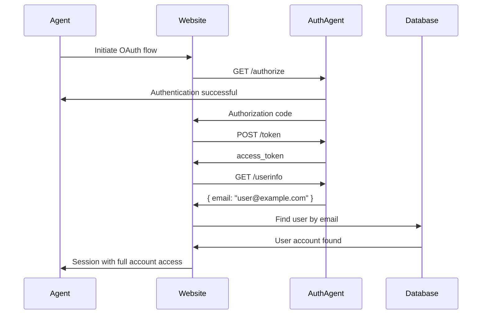
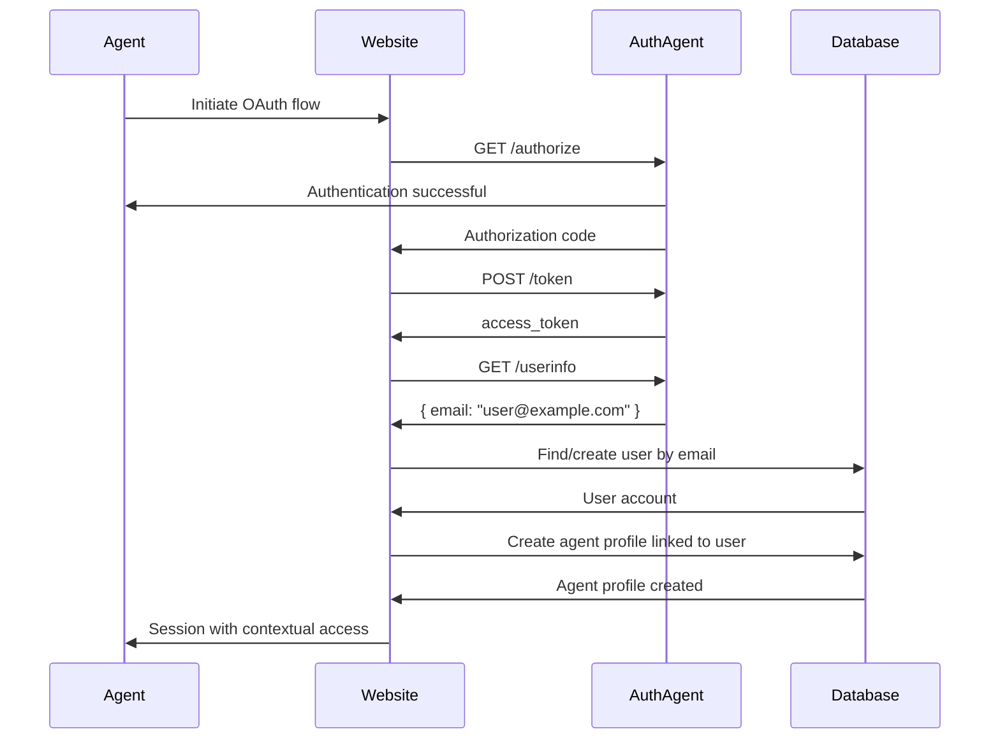
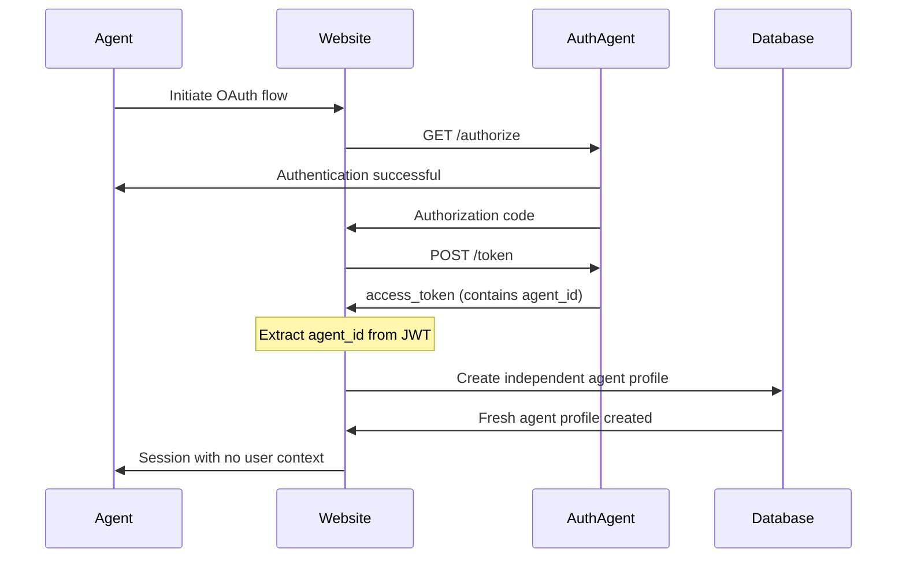

## Overview

Auth Agent supports three distinct integration patterns, allowing websites to choose how they handle AI agent authentication based on their specific requirements and user expectations.

## The Three Scenarios

<CardGroup cols={3}>
  <Card title="Full Account Access" icon="user-check">
    Agent operates within the user's existing account
  </Card>
  <Card title="Contextual Profile" icon="link">
    Separate agent profile with access to user context
  </Card>
  <Card title="Fresh Profile" icon="sparkles">
    Independent agent profile with no user data
  </Card>
</CardGroup>

---

## Scenario 1: Full Account Access

The agent operates directly within the user's existing account with complete access to their data and preferences.

### When to Use

- E-commerce sites where agents need to access order history and saved items
- Banking apps where agents manage the user's actual accounts
- Email clients where agents read and send from the user's inbox
- Any service where the agent is acting on behalf of the user

### Implementation

<Steps>
  <Step title="Exchange Authorization Code">
    After receiving the authorization code, exchange it for access tokens
  </Step>
  <Step title="Get User Email">
    Call `/userinfo` to get the user's email address
  </Step>
  <Step title="Link to Existing Account">
    Find the user's existing account by email and create a session
  </Step>
  <Step title="Grant Full Access">
    The agent now has complete access to the user's account
  </Step>
</Steps>

### Code Example

```typescript
// After OAuth callback with authorization code
async function handleFullAccountAccess(code: string, codeVerifier: string) {
  // Exchange code for tokens
  const tokens = await exchangeCodeForTokens(code, codeVerifier);

  // Get user information
  const userInfo = await fetch('https://api.auth-agent.com/userinfo', {
    headers: { Authorization: `Bearer ${tokens.access_token}` },
  }).then(r => r.json());

  // Find existing user account by email
  const existingUser = await db.users.findOne({
    where: { email: userInfo.email }
  });

  if (!existingUser) {
    throw new Error('User account not found');
  }

  // Create session with full account access
  const session = await createSession({
    userId: existingUser.id,
    type: 'agent',
    agentId: userInfo.sub,
    accessToken: tokens.access_token,
    refreshToken: tokens.refresh_token,
  });

  return { sessionId: session.id, user: existingUser };
}
```

### Flow Diagram



### Pros & Cons

<AccordionGroup>
  <Accordion title="Advantages">
    - Seamless experience for users
    - Agent has access to all user data and history
    - Simpler implementation
    - No data duplication
  </Accordion>

  <Accordion title="Disadvantages">
    - Agent actions appear as user actions
    - Harder to distinguish agent vs user activity
    - Higher security risk if agent is compromised
    - May not comply with some regulatory requirements
  </Accordion>
</AccordionGroup>

---

## Scenario 2: Contextual Profile

Create a separate agent profile but provide access to the user's context and data.

### When to Use

- Social media where you want separate agent activity but need access to user's network
- Content platforms where agents create content under their own identity but can access user preferences
- Collaboration tools where agent actions should be clearly attributed but need user context
- Services that need to audit agent vs user actions separately

### Implementation

<Steps>
  <Step title="Exchange Authorization Code">
    After receiving the authorization code, exchange it for access tokens
  </Step>
  <Step title="Get User Email">
    Call `/userinfo` to get the user's email address
  </Step>
  <Step title="Create Agent Profile">
    Create a new agent profile linked to the user's account
  </Step>
  <Step title="Grant Contextual Access">
    Agent can access user data but actions are attributed to the agent
  </Step>
</Steps>

### Code Example

```typescript
async function handleContextualProfile(code: string, codeVerifier: string) {
  // Exchange code for tokens
  const tokens = await exchangeCodeForTokens(code, codeVerifier);

  // Get user information
  const userInfo = await fetch('https://api.auth-agent.com/userinfo', {
    headers: { Authorization: `Bearer ${tokens.access_token}` },
  }).then(r => r.json());

  // Find or create user by email
  const user = await db.users.findOrCreate({
    where: { email: userInfo.email },
    defaults: { name: userInfo.name },
  });

  // Create agent profile linked to user
  const agentProfile = await db.agentProfiles.create({
    agentId: userInfo.sub,
    linkedUserId: user.id,
    name: `${user.name}'s Agent`,
    model: extractModelFromToken(tokens.access_token),
  });

  // Create session for agent profile
  const session = await createSession({
    agentProfileId: agentProfile.id,
    linkedUserId: user.id,  // Link for context access
    type: 'agent_contextual',
    accessToken: tokens.access_token,
    refreshToken: tokens.refresh_token,
  });

  return { sessionId: session.id, agentProfile, linkedUser: user };
}
```

### Access Control Example

```typescript
// Middleware to handle contextual access
function requireContextualAccess(req, res, next) {
  const session = req.session;

  if (session.type !== 'agent_contextual') {
    return res.status(403).json({ error: 'Invalid session type' });
  }

  // Agent can read user data
  req.canReadUserData = true;

  // But writes are attributed to agent
  req.actorId = session.agentProfileId;
  req.actorType = 'agent';

  next();
}

// Example usage
app.post('/api/posts', requireContextualAccess, async (req, res) => {
  const { linkedUserId, agentProfileId } = req.session;

  // Agent can read user's preferences
  const userPrefs = await db.preferences.findOne({
    where: { userId: linkedUserId }
  });

  // But post is created by the agent
  const post = await db.posts.create({
    content: req.body.content,
    authorId: agentProfileId,
    authorType: 'agent',
    // Can use user preferences
    visibility: userPrefs.defaultVisibility,
  });

  res.json(post);
});
```

### Flow Diagram



### Pros & Cons

<AccordionGroup>
  <Accordion title="Advantages">
    - Clear attribution of agent actions
    - Agent has access to user context
    - Better audit trail
    - Balanced security model
    - Can implement fine-grained access control
  </Accordion>

  <Accordion title="Disadvantages">
    - More complex implementation
    - Need to manage agent profiles separately
    - Must define access control rules
    - Potential for confusion about what agent can access
  </Accordion>
</AccordionGroup>

---

## Scenario 3: Fresh Profile

Create a completely independent agent profile with no access to user context or data.

### When to Use

- Services where privacy is paramount
- Platforms where agent and user identities should be completely separate
- Testing environments
- Services that don't require user context
- Compliance with strict data separation requirements

### Implementation

<Steps>
  <Step title="Exchange Authorization Code">
    After receiving the authorization code, exchange it for access tokens
  </Step>
  <Step title="Skip /userinfo Call">
    Do NOT call `/userinfo` - no need for user email
  </Step>
  <Step title="Extract Agent ID">
    Get agent ID from the access token JWT
  </Step>
  <Step title="Create Fresh Profile">
    Create a new, independent agent profile
  </Step>
</Steps>

### Code Example

```typescript
async function handleFreshProfile(code: string, codeVerifier: string) {
  // Exchange code for tokens
  const tokens = await exchangeCodeForTokens(code, codeVerifier);

  // DO NOT call /userinfo - we don't need user email

  // Extract agent ID from JWT
  const decoded = jwt.decode(tokens.access_token);
  const agentId = decoded.sub;
  const model = decoded.model;

  // Create fresh agent profile (no user linkage)
  const agentProfile = await db.agentProfiles.create({
    agentId: agentId,
    model: model,
    name: `Agent ${agentId.slice(-6)}`,
    // No linkedUserId - completely independent
  });

  // Create session for agent profile
  const session = await createSession({
    agentProfileId: agentProfile.id,
    type: 'agent_fresh',
    accessToken: tokens.access_token,
    refreshToken: tokens.refresh_token,
  });

  return { sessionId: session.id, agentProfile };
}
```

### Flow Diagram



### Pros & Cons

<AccordionGroup>
  <Accordion title="Advantages">
    - Maximum privacy
    - Clear separation of identities
    - Simpler permission model
    - No risk of accessing user data
    - Better for compliance
  </Accordion>

  <Accordion title="Disadvantages">
    - Agent cannot access user preferences
    - No personalization
    - May require agent to ask for information the user already provided
    - Less seamless user experience
  </Accordion>
</AccordionGroup>

---

## Comparison Table

| Feature | Full Account | Contextual Profile | Fresh Profile |
|---------|-------------|-------------------|--------------|
| **User Email Access** | ✅ Yes | ✅ Yes | ❌ No |
| **Access to User Data** | ✅ Full | ⚠️ Read-only | ❌ None |
| **Agent Attribution** | ❌ No | ✅ Yes | ✅ Yes |
| **Privacy Level** | ⚠️ Low | ⚠️ Medium | ✅ High |
| **Implementation Complexity** | 🟢 Simple | 🟡 Medium | 🟢 Simple |
| **Use `/userinfo`** | ✅ Required | ✅ Required | ❌ Not needed |
| **Personalization** | ✅ Full | ⚠️ Partial | ❌ None |

---

## Decision Guide

<Steps>
  <Step title="Does the agent need to act on the user's behalf?">
    **Yes** → Full Account Access (Scenario 1)

    **No** → Continue to next question
  </Step>

  <Step title="Does the agent need user context or preferences?">
    **Yes** → Contextual Profile (Scenario 2)

    **No** → Fresh Profile (Scenario 3)
  </Step>

  <Step title="Are there strict privacy or compliance requirements?">
    **Yes** → Consider Fresh Profile (Scenario 3) or implement strict access controls in Contextual Profile (Scenario 2)

    **No** → Choose based on user experience needs
  </Step>
</Steps>

## Implementation Checklist

<Tabs>
  <Tab title="Full Account">
    - [ ] Implement OAuth flow with `email` scope
    - [ ] Call `/userinfo` endpoint after token exchange
    - [ ] Find existing user by email
    - [ ] Handle case where user doesn't exist
    - [ ] Create session with full account access
    - [ ] Implement logout with token revocation
    - [ ] Add agent identification in activity logs
  </Tab>

  <Tab title="Contextual Profile">
    - [ ] Implement OAuth flow with `email` scope
    - [ ] Call `/userinfo` endpoint after token exchange
    - [ ] Find or create user by email
    - [ ] Create agent profile linked to user
    - [ ] Define access control rules for contextual data
    - [ ] Attribute all actions to agent profile
    - [ ] Implement contextual access middleware
    - [ ] Add clear UI indicators for agent actions
  </Tab>

  <Tab title="Fresh Profile">
    - [ ] Implement OAuth flow (can omit `email` scope)
    - [ ] Do NOT call `/userinfo` endpoint
    - [ ] Extract agent ID from JWT
    - [ ] Create independent agent profile
    - [ ] Implement standard access controls
    - [ ] Handle onboarding flow for new agent
    - [ ] Consider adding agent-to-user linking feature
  </Tab>
</Tabs>

## Best Practices

<AccordionGroup>
  <Accordion title="Communicate Clearly">
    Make it clear to users which scenario you're implementing. Show them what data the agent can access during the authorization flow.
  </Accordion>

  <Accordion title="Implement Revocation">
    Allow users to revoke agent access at any time through your settings page. Call the `/revoke` endpoint to invalidate tokens.
  </Accordion>

  <Accordion title="Audit Logs">
    Keep detailed logs of agent actions, especially for Scenario 1 (Full Account Access) where agent actions appear as user actions.
  </Accordion>

  <Accordion title="Rate Limiting">
    Implement rate limiting for agent requests, as agents may make more requests than typical users.
  </Accordion>

  <Accordion title="Security Monitoring">
    Monitor for unusual patterns that might indicate a compromised agent or unauthorized access.
  </Accordion>
</AccordionGroup>

## Next Steps

<CardGroup cols={2}>
  <Card title="Quickstart Guide" icon="rocket" href="/quickstart">
    Implement your chosen scenario
  </Card>
  <Card title="API Reference" icon="code" href="/api-reference/overview">
    Detailed endpoint documentation
  </Card>
  <Card title="Security Best Practices" icon="shield" href="/guides/security">
    Secure your integration
  </Card>
  <Card title="Code Examples" icon="book-code" href="/guides/examples">
    Real-world implementation examples
  </Card>
</CardGroup>
